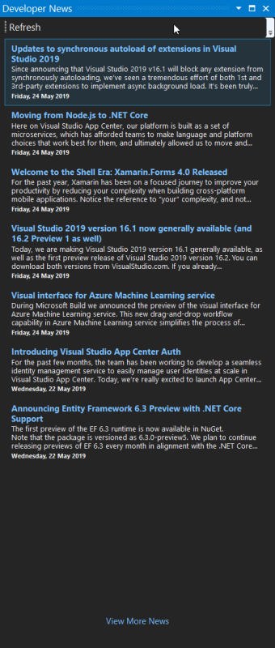
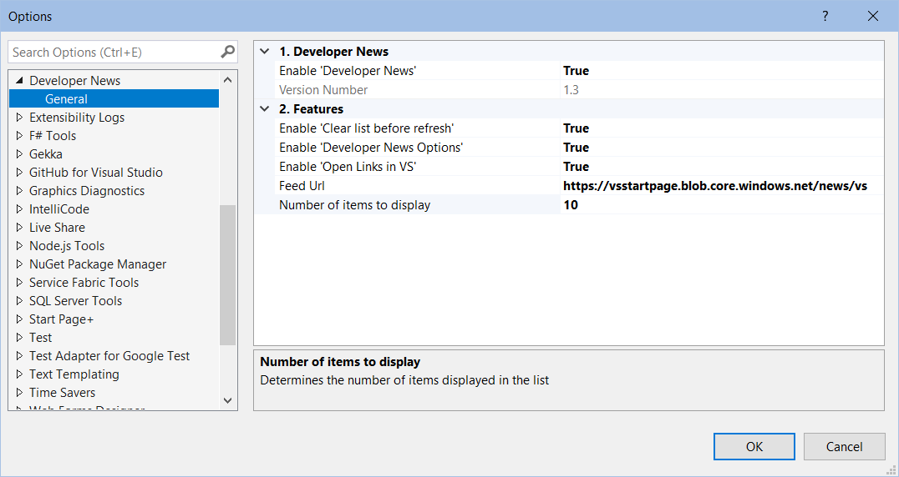

To display the new *Developer News* window:

- click **View** | **Developer News**

## Dev News Feed

The _Dev News_ feed is based on the feed from the Developer News control on the old VS 2017 startup page.
It's the first feed that has been added to the new _Developer News_ window.

## Other Feeds

Other feeds will follow in the near future. Check out the [Roadmap][roadmap-url] for more details.

[roadmap-url]: https://luminous-software.solutions/developer-news/roadmap

## Options

### Enable 'Developer News'

This setting allows the whole set of _Developer News_ features to be turned off together.

### Version Number

Displays then version number of _Developer News_ that's currently installed.

### Enable 'Open Links in VS'

The default value is `true`, meaning that any item link that is clicked will be opened in a window
inside of Visual Studio.

A value of `false` will result in the link being opened in your default browser.