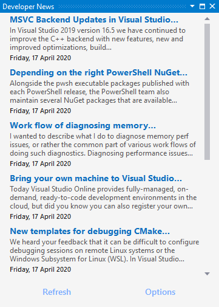

To display the new *Developer News* window:

- click **View** | **Developer News**

## Dev News Feed

The _Dev News_ feed is based on the feed from the _Developer News_ control on the old VS 2017 startup page.

## Options

### Enable 'Developer News'

This setting allows the whole set of _Developer News_ features to be turned off together.

### Version Number

Displays then version number of _Developer News_ that's currently installed.

### Enable 'Clear list before refresh'

The default value is `true`, which means that the list will be cleared before a refresh is performed.
This gives a visual indication that the list is being refreshed.

A value of `false` may mean that the list refreshes so fast that it's not obvious that it was in fact refreshed.

### Enable 'Developer News Options'

The default value is `true`, which adds a 'Developer News Options' command to be added to the `Tools` | `Options` menu.

### Enable 'Open Links in VS'

The default value is `true`, meaning that any item link that is clicked will be opened in a window
inside of Visual Studio.

A value of `false` will result in the link being opened in your default browser.

### Feed Url

This setting allows the list to be populated from an RSS feed other than that of VS 2017's _Developer News_.

The default value is https://vsstartpage.blob.core.windows.net/news/vs.

### Number of Items to display

This allows you to limit the number of items displayed in the list.

The default value is `10`. This is how many items that Microsoft currently maintains in the default feed.
Only the newest three get displayed in the Installer's _Developer News_ section even though it points to the same source.

A value greater than `10` will still only display ten items. A value of `0` will currently display zero items,
but this may in the future be changed to indicate that all items in the feed should be displayed.