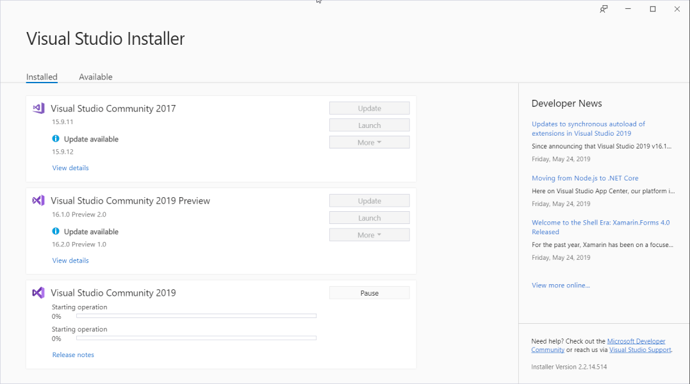

![Version][version-badge-url]
[![License][license-badge]](https://github.com/luminous-software/developer-news/blob/master/LICENSE)
[![Donate][paypal-badge]](https://www.paypal.me/yannduran/5)

[version-badge-url]: http://vsmarketplacebadge.apphb.com/version-short/YannDuran.DeveloperNews.svg?label=version&colorB=7E57C2&style=flat-square
[license-badge]: https://img.shields.io/badge/license-MIT-7E57C2.svg?style=flat-square
[license-url]: https://github.com/luminous-software/developer-news/blob/master/LICENSE
[paypal-badge]: https://img.shields.io/badge/donate-paypal-green.svg?style=flat-square
[paypal-url]: https://www.paypal.me/yannduran/10

You can download this extension [from the Visual Studio Marketplace][marketplace-url]

[marketplace-url]: https://marketplace.visualstudio.com/items?itemName=YannDuran.DeveloperNews

---

## Developer News Is Gone

When Visual Studio 2019 was released, many developers were dismayed to find that the _Start Page_ had been completely
replaced by the new _Start Window_ (a big **modal** dialog, which had no room for _Developer News_).

### Community Outcry

There was a **huge** outpouring of disatification on the [Developer Community forum][developer-community-forum-url] that
not only had the _Start Page_ been taken away (& _Developer News_ with it), but we were left with **no way to get _Developer News_
in Visual Studio anymore**.

[developer-community-forum-url]: https://developercommunity.visualstudio.com/idea/399833/bring-back-the-developer-news-on-startup.html

### Microsoft's Response
Increduously, Microsoft's response was to simply
[add Developer News to the right column of the Visual Studio installer][microsoft-announcement-url].
But nobody wanted to have to open the installer just to view their morning developer news.
They wanted to see it as soon as they opened Visual Studio, as they had done for years.

[microsoft-announcement-url]: https://developercommunity.visualstudio.com/comments/469066/view.html

### My Announcement

I wrote [a post to announce][my-announcement-url] "_I've decided to write a little extension to add a tool window
to display the missing Developer News, either as a stop-gap until MS decide to see sense, or to use instead for the
future going forward if they don't_"

[my-announcement-url]: https://developercommunity.visualstudio.com/comments/513534/view.html

### Start Page Is Back
Another developer, [Jan Kučera][jan-kučera-url], released his [Start Page on Startup][start-page-on-startup-url]
extension to restore access to the _VS 2017 Start Page_, which of course also restored the _Developer News_ feed.
The only problem is that Jan's extension relies on the RSS feed control in Visual Studio 2019's internal implementation
which, as a [Microsoft employee reminded us][microsoft-employee-url], "_is subject to **vanish at anytime**_".

[jan-kučera-url]: https://marketplace.visualstudio.com/publishers/JanKucera
[start-page-on-startup-url]: https://marketplace.visualstudio.com/items?itemName=JanKucera.StartPageOnStartup
[microsoft-employee-url]: https://developercommunity.visualstudio.com/comments/513807/view.html

### Developer News Is Back!

My new [Developer News v1.0][developer-news-url] extension adds a **dockable tool window** to display a _Dev News_ feed,
based on the feed that the _Start Page_ used to provide,
but which doesn't rely on Visual Studio's internal _Start Page_ implementation.

When Microsoft removes that funtionality (& I do believe that they'll remove it), any extensions that rely on it
will cease to function. _Developer News_ has been written from the ground up and will **not** be affected.

The _Dev News_ feed is the **first** developer news feed to be added to _Developer News_,
with **more feeds to come** in the near future (check out [the roadmap][roadmap-url]for more details).

[developer-news-url]: https://marketplace.visualstudio.com/items?itemName=YannDuran.DeveloperNews

## More Information

You can read more about _Developer News_ on its website:

[Overview][website-url] **|** [Getting Started][getting-started-url] **|** [Features][features-url] **|** [Changelog][changelog-url] **|** [Roadmap][roadmap-url]

[website-url]: https://luminous-software.solutions/developer-news
[getting-started-url]: https://luminous-software.solutions/developer-news/getting-started
[features-url]: https://luminous-software.solutions/developer-news/features
[changelog-url]: https://luminous-software.solutions/developer-news/changelog
[roadmap-url]: https://luminous-software.solutions/developer-news/roadmap

## Support the Project

If *Developer News* has saved you time and hassle, please come back and show your support:

- you could [***rate *Developer News****][rate-or-review-url] (only takes a couple of seconds)
- or [***review *Developer News****][rate-or-review-url] (help others benefit from your experience)
- or [***shout me a coke***](https://www.paypal.me/yannduran/5) (I don't drink coffee or beer lol)

[rate-or-review-url]: https://marketplace.visualstudio.com/items?itemName=YannDuran.DeveloperNews#review-details
[qna-url]: https://marketplace.visualstudio.com/items?itemName=YannDuran.DeveloperNews#qna
[suggestions-url]: https://marketplace.visualstudio.com/items?itemName=YannDuran.DeveloperNews#qna

[icon-url]: /assets/images/favicon.ico

[contributing-url]: https://github.com/luminous-software/developer-news/blob/master/.github/CONTRIBUTING.md
